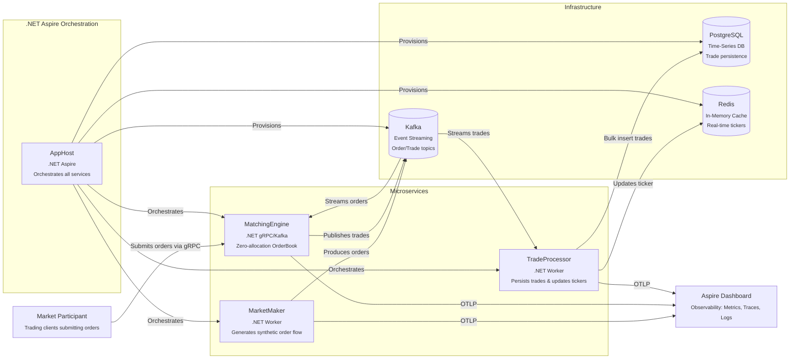
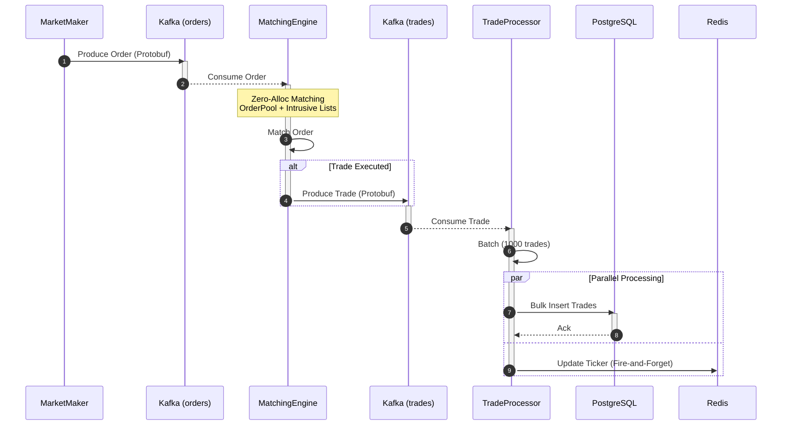

# FalconFX 🚀

[](https://dotnet.microsoft.com/)
[](https://learn.microsoft.com/dotnet/aspire/)
[](https://kafka.apache.org/)
[](https://redis.io/)
[](https://www.postgresql.org/)
[](https://www.docker.com/)
[](https://opentelemetry.io/)

A production-grade **High-Frequency Trading (HFT) Simulation** engine built on **.NET 9** and **.NET Aspire**, demonstrating enterprise-level microservices architecture with extreme performance optimizations for financial systems.

## 🎯 Overview

FalconFX simulates a complete electronic trading ecosystem capable of processing **300,000+ orders per second** with **sub-millisecond latency**. The system employs zero-allocation matching algorithms, lock-free data structures, and event-driven architecture to achieve high throughput while maintaining reliability and observability.

## 🏗️ Architecture

### System Architecture (C4 Container Diagram)



### Order Execution Flow (Sequence Diagram)



## ⚡ Key Features

### 🎯 Zero-Allocation Matching Engine

The core matching engine eliminates GC pressure through advanced memory management techniques:

- **Struct-Based Order Pool**: Pre-allocated array of `OrderNode` structs (10M capacity) prevents heap allocations during hot path execution
- **Intrusive Linked Lists**: Orders maintain `Next` and `Prev` indices instead of references, enabling O(1) insertion/removal without allocations
- **Price-Level Arrays**: Fixed-size arrays for bid/ask levels (prices 90-110) enable constant-time price lookups
- **Callback-Based Trade Publishing**: Delegates avoid lambda allocations in tight loops

```csharp
// Example: Zero-allocation order processing
public void ProcessOrder(Order order, TradeCallback onTrade)
{
    // All operations use stack-allocated structs and array indices
    // No 'new' keyword in the hot path!
}
```

### 🔥 High Throughput Architecture

- **System.Threading.Channels**: Lock-free producer-consumer queues for order ingestion and trade publishing
- **Batch Processing**: TradeProcessor accumulates 1,000 trades before bulk database insert
- **Kafka Optimization**:
  - LZ4 compression for network efficiency
  - Leader acknowledgment for balanced durability/speed
  - Configurable linger times for batching
- **Redis Fire-and-Forget**: Non-blocking ticker updates prevent I/O bottlenecks

### 🛡️ Resilience & Reliability

- **WaitForBrokerReady**: Health checks ensure Kafka is fully initialized before service startup
- **Topic Auto-Creation**: `EnsureTopicExistsAsync` utility prevents "unknown topic" errors
- **Retry Policies**: Graceful handling of transient failures in Kafka consumption
- **Service Dependencies**: `.WaitFor()` ensures correct startup order (e.g., Engine waits for Kafka)

### 📊 Observability (OpenTelemetry)

Complete distributed tracing and metrics via OpenTelemetry:

- **Custom Metrics**: `orders_processed`, `trades_created` counters
- **Distributed Traces**: End-to-end transaction visibility across Kafka and microservices
- **Aspire Dashboard**: Real-time visualization of all telemetry data
- **Batched OTLP Export**: 5-second intervals prevent telemetry overhead

## 🏆 Performance Metrics

Based on production-equivalent load testing:

| Metric | Value | Notes |
|--------|-------|-------|
| **Order Throughput** | 300,000+ orders/sec | Sustained load with tight price spreads |
| **Matching Latency** | < 1ms (p99) | Hot path execution time |
| **Trade Persistence** | 1,000 trades/batch | Bulk insert to PostgreSQL |
| **Memory Allocation** | ~0 bytes/order | Zero-alloc matching algorithm |
| **GC Pressure** | Minimal | Gen0 only, no Gen1/Gen2 collections |

*Tested on: AMD Ryzen 7 / 16GB RAM / Docker Desktop*

## 📦 Project Structure

```
FalconFX/
├── src/
│   ├── FalconFX.AppHost/           # .NET Aspire orchestrator
│   │   └── Program.cs              # Infrastructure provisioning
│   ├── FalconFX.ServiceDefaults/   # Shared telemetry & Kafka utilities
│   │   ├── Extensions.cs           # OpenTelemetry configuration
│   │   └── KafkaUtils.cs           # Broker health checks
│   ├── MarketMaker/                # Order generation service
│   │   └── Worker.cs               # Synthetic order producer
│   ├── MatchingEngine/             # Core matching logic
│   │   ├── EngineWorker.cs         # Order processing loop
│   │   ├── KafkaWorker.cs          # Kafka consumer
│   │   ├── OrderBook.cs            # Zero-alloc matching algorithm
│   │   ├── OrderPool.cs            # Pre-allocated memory pool
│   │   └── Models/                 # Order, Trade, OrderNode structs
│   └── TradeProcessor/             # Trade persistence service
│       ├── Worker.cs               # Kafka-to-DB pipeline
│       └── TradeDbContext.cs       # EF Core context
└── tests/
    └── MatchingEngine.Tests/       # Unit tests
```

### Microservices Overview

#### 1. **MarketMaker** (Order Generator)
- Produces synthetic orders at high velocity (100 orders per batch)
- Tight price spread (99-101) ensures frequent matches
- Uses Protobuf for efficient serialization
- Publishes to `orders` Kafka topic

#### 2. **MatchingEngine** (Core Logic)
- Consumes orders from Kafka (`orders` topic)
- Implements Price-Time Priority matching algorithm
- Publishes executed trades to Kafka (`trades` topic)
- Custom metrics exported to Aspire Dashboard
- Supports both Kafka and gRPC ingestion

#### 3. **TradeProcessor** (Persistence Layer)
- Consumes trades from Kafka (`trades` topic)
- Batch inserts to PostgreSQL (1,000 trades/batch)
- Updates Redis tickers in fire-and-forget mode
- TimescaleDB-ready schema with timestamp indexing

## 🚀 Getting Started

### Prerequisites

- [.NET 9 SDK](https://dotnet.microsoft.com/download/dotnet/9.0)
- [Docker Desktop](https://www.docker.com/products/docker-desktop)

### Run with .NET Aspire

1. **Clone the repository**
   ```bash
   git clone https://github.com/yourusername/FalconFX.git
   cd FalconFX
   ```

2. **Launch the entire system**
   ```bash
   cd src/FalconFX.AppHost
   dotnet run
   ```

3. **Access the Aspire Dashboard**

   The dashboard URL will be displayed in the console (typically `https://localhost:17171`)

   - **Structured Logs**: Real-time log aggregation from all services
   - **Metrics**: Live charts for order throughput and trade volume
   - **Traces**: Distributed transaction timelines
   - **Resources**: Container health and resource usage

4. **Explore Infrastructure UIs**

   - **Kafka UI**: `http://localhost:8080` - Topic inspection and consumer lag monitoring
   - **pgAdmin**: `http://localhost:5050` - PostgreSQL query interface
   - **Redis Commander**: `http://localhost:8081` - Real-time key-value viewer

### Verify System Health

Watch for these log messages indicating successful startup:

```
✅ Kafka is READY. Found 1 brokers.
✅ Topic 'orders' created successfully.
✅ Topic 'trades' created successfully.
🚀 Engine Started. Waiting for orders...
🚀 Starting Producer...
💾 Trade Processor Started. Listening...
📊 STATS: Processed: 300,000 orders | Matches: 150,000 trades
```

## 🔧 Configuration

### Kafka Settings (MarketMaker)

```csharp
LingerMs = 5,              // Batch window
BatchSize = 1MB,           // Max batch size
CompressionType = Lz4,     // Compression algorithm
Acks = Leader              // Durability level
```

### Matching Engine Pool Size

Adjust the OrderPool capacity based on expected concurrent orders:

```csharp
private readonly OrderBook _orderBook = new(10_000_000); // 10M orders
```

### Trade Processor Batch Size

Optimize for database write performance:

```csharp
private const int BatchSize = 1000; // Trades per DB flush
```

## 🧪 Testing

Run unit tests for the matching engine:

```bash
cd tests/MatchingEngine.Tests
dotnet test
```

**Test Coverage:**
- ✅ Full match scenarios
- ✅ Partial fill logic
- ✅ Price-Time Priority enforcement
- ✅ Order book depth validation

## 📈 Monitoring & Observability

### OpenTelemetry Metrics

- `orders_processed` (Counter): Total orders consumed by MatchingEngine
- `trades_created` (Counter): Total trades executed

### Custom Activities

Distributed traces include custom spans for:
- Order deserialization
- Matching algorithm execution
- Trade serialization and publishing

### Aspire Dashboard Features

1. **Live Metrics**: Real-time graphs of throughput and latency
2. **Distributed Traces**: End-to-end request tracking across Kafka
3. **Structured Logs**: Centralized logging with filtering and search
4. **Resource Health**: Container status and dependency graph

## 🛠️ Technology Stack

| Component | Technology | Purpose |
|-----------|-----------|---------|
| **Framework** | .NET 9 | Latest performance improvements |
| **Orchestration** | .NET Aspire 13.0 | Service orchestration and observability |
| **Messaging** | Apache Kafka | Event streaming backbone |
| **Caching** | Redis | Real-time ticker storage |
| **Database** | PostgreSQL | Time-series trade persistence |
| **Serialization** | Protobuf | Efficient binary encoding |
| **Telemetry** | OpenTelemetry | Distributed tracing and metrics |
| **Containerization** | Docker | Consistent deployment environments |

## 🎓 Learning Resources

This project demonstrates:

- **Microservices Architecture**: Service decomposition, communication patterns
- **Event-Driven Design**: Kafka producers/consumers, event sourcing
- **Performance Engineering**: Zero-allocation algorithms, memory pooling
- **Observability**: OpenTelemetry instrumentation, distributed tracing
- **.NET Aspire**: Modern cloud-native orchestration

## 🤝 Contributing

Contributions are welcome! Areas for enhancement:

- [ ] gRPC streaming client for external order submission
- [ ] WebSocket API for real-time ticker broadcasting
- [ ] Advanced order types (Stop, FOK, IOC)
- [ ] Market depth visualization dashboard
- [ ] Kubernetes deployment manifests

## 📄 License

This project is licensed under the MIT License - see the [LICENSE](LICENSE) file for details.

## 🙏 Acknowledgments

- **Aspire Team** for the excellent orchestration framework
- **Confluent** for Kafka client libraries
- **PostgreSQL** and **Redis** communities for robust infrastructure

---

**Built with ❤️ using .NET 9 and Aspire** | [Report Issues](https://github.com/yourusername/FalconFX/issues) | [Documentation](https://github.com/yourusername/FalconFX/wiki)