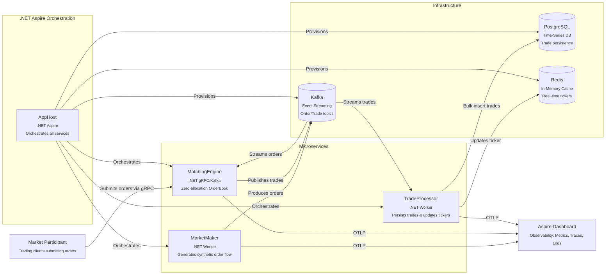
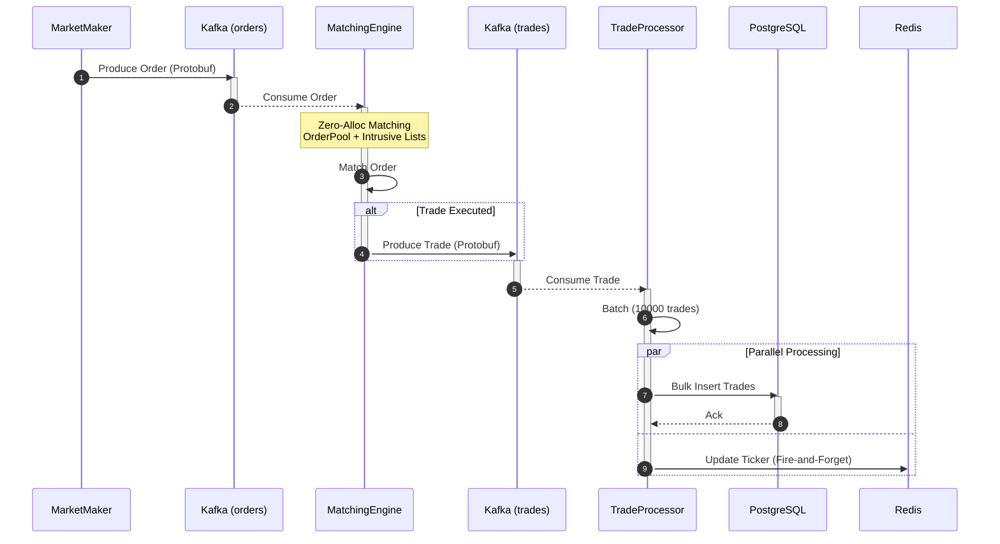

# FalconFX 🚀

[](https://dotnet.microsoft.com/)
[](https://learn.microsoft.com/dotnet/aspire/)
[](https://kafka.apache.org/)
[](https://redis.io/)
[](https://www.postgresql.org/)
[](https://www.docker.com/)
[](https://opentelemetry.io/)

A production-grade **High-Frequency Trading (HFT) Simulation** engine built on **.NET 10** and **.NET Aspire 13.4**, demonstrating enterprise-level microservices architecture with low-latency performance optimizations for financial systems.

## 🎯 Overview

FalconFX simulates an electronic trading ecosystem. Under BenchmarkDotNet micro-benchmarks, the core matching engine algorithm handles **~61.3 Million orders per second** at a single-core level with **~16.3 nanoseconds** of latency. On a fully distributed network level with active Kafka event streams and PostgreSQL bulk persistence, the end-to-end system achieves a throughput of up to **66,500+ orders per second** with **15-microsecond (0.015 ms)** average latency.

The system employs zero-allocation matching algorithms, lock-free data structures, and event-driven architecture to maintain performance, durability, and observability.

## 🏗️ Architecture

### System Architecture (C4 Container Diagram)


```mermaid
flowchart LR

    %% PERSON
    user[Market Participant<br/><sub>Trading clients submitting orders</sub>]

    %% GROUPS (BOUNDARIES)
    subgraph aspire[.NET Aspire Orchestration]
        apphost[AppHost<br/><sub>.NET Aspire<br/>Orchestrates all services</sub>]
    end

    subgraph services[Microservices]
        marketmaker[MarketMaker<br/><sub>.NET Worker<br/>Generates synthetic order flow</sub>]
        engine[MatchingEngine<br/><sub>.NET gRPC/Kafka<br/>Zero-allocation OrderBook</sub>]
        processor[TradeProcessor<br/><sub>.NET Worker<br/>Persists trades & updates tickers</sub>]
    end

    subgraph infra[Infrastructure]
        kafka[(Kafka<br/><sub>Event Streaming<br/>Order/Trade topics</sub>)]
        postgres[(PostgreSQL<br/><sub>Time-Series DB<br/>Trade persistence</sub>)]
        redis[(Redis<br/><sub>In-Memory Cache<br/>Real-time tickers</sub>)]
    end

    dashboard[Aspire Dashboard<br/><sub>Observability: Metrics, Traces, Logs</sub>]

    %% RELATIONSHIPS
    user -->|Submits orders via gRPC| engine

    marketmaker -->|Produces orders| kafka
    kafka -->|Streams orders| engine

    engine -->|Publishes trades| kafka
    kafka -->|Streams trades| processor

    processor -->|Bulk insert trades| postgres
    processor -->|Updates ticker| redis

    %% ASP.NET ASPIRE ORCHESTRATION
    apphost -->|Orchestrates| marketmaker
    apphost -->|Orchestrates| engine
    apphost -->|Orchestrates| processor
    apphost -->|Provisions| kafka
    apphost -->|Provisions| postgres
    apphost -->|Provisions| redis

    %% TELEMETRY
    marketmaker -->|OTLP| dashboard
    engine -->|OTLP| dashboard
    processor -->|OTLP| dashboard

```

### Order Execution Flow (Sequence Diagram)


```mermaid
sequenceDiagram
    autonumber
    participant MM as MarketMaker
    participant K1 as Kafka (orders)
    participant ME as MatchingEngine
    participant K2 as Kafka (trades)
    participant TP as TradeProcessor
    participant PG as PostgreSQL
    participant RD as Redis

    MM->>K1: Produce Order (Protobuf)
    activate K1
    K1-->>ME: Consume Order
    deactivate K1

    activate ME
    Note over ME: Zero-Alloc Matching<br/>OrderPool + Intrusive Lists
    ME->>ME: Match Order
    alt Trade Executed
        ME->>K2: Produce Trade (Protobuf)
    end
    deactivate ME

    activate K2
    K2-->>TP: Consume Trade
    deactivate K2

    activate TP
    TP->>TP: Batch (10000 trades)

    par Parallel Processing
        TP->>PG: Bulk Insert Trades
        activate PG
        PG-->>TP: Ack
        deactivate PG
    and
        TP->>RD: Update Ticker (Fire-and-Forget)
    end
    deactivate TP
```

## ⚡ Key Features

### 🎯 Zero-Allocation Matching Engine

The core matching engine minimizes GC pressure through targeted memory management techniques:

- **Struct-Based Order Pool**: Pre-allocated array of `OrderNode` structs (up to 10M capacity) prevents heap allocations during hot path execution.
- **Intrusive Linked Lists**: Orders maintain `Next` and `Prev` indices instead of heap-allocated references, enabling O(1) insertion/removal without allocations.
- **Price-Level Arrays**: Fixed-size arrays for bid/ask levels enable constant-time price lookups.
- **Callback-Based Trade Publishing**: Delegates avoid lambda allocations in tight loops.

```csharp
// Example: Zero-allocation order processing
public void ProcessOrder(Order order, TradeCallback onTrade)
{
    // All operations use stack-allocated structs and array indices
    // No 'new' keyword in the hot path!
}
```

### 🔥 High Throughput Architecture

- **System.Threading.Channels**: Lock-free producer-consumer queues for order ingestion and trade publishing.
- **Batch Processing**: TradeProcessor accumulates up to 10,000 trades before a bulk database insert.
- **PostgreSQL Binary COPY**: Uses low-level `BeginBinaryImportAsync` for bulk writes, bypassing EF Core overhead.
- **Kafka Optimization**:
  - LZ4 compression for network efficiency.
  - Leader acknowledgment for balanced durability and speed.
  - Configurable linger times for batching.
- **Redis Fire-and-Forget**: Non-blocking ticker updates prevent I/O bottlenecks.

### 🛡️ Resilience & Reliability

- **WaitForBrokerReady**: Health checks ensure Kafka is fully initialized before service startup.
- **Topic Auto-Creation**: `EnsureTopicExistsAsync` utility prevents "unknown topic" errors.
- **Retry Policies**: Graceful handling of transient failures in Kafka consumption.
- **Service Dependencies**: `.WaitFor()` ensures correct startup order (e.g., Engine waits for Kafka).

### 📊 Observability (OpenTelemetry)

Distributed tracing and metrics via OpenTelemetry:

- **Custom Metrics**: `orders_processed`, `trades_created` counters.
- **Distributed Traces**: End-to-end transaction visibility across Kafka and microservices.
- **Aspire Dashboard**: Visualization of all telemetry data.
- **Batched OTLP Export**: 5-second intervals prevent telemetry overhead in tight execution loops.

## 🏆 Performance Metrics

Based on automated E2E system testing (under BenchmarkDotNet and Aspire test runners):

| Metric | Value | Notes |
|--------|-------|-------|
| **Core Throughput (L1)** | ~61,300,000 orders/sec | Pure C# OrderBook Algorithm |
| **Pipeline Throughput (L2)** | ~2,317,000 orders/sec | Protobuf parsing + Channels + Engine Worker |
| **System E2E Throughput (L3)**| Up to 66,500 orders/sec | End-to-end network, Kafka, and PostgreSQL persistence |
| **E2E Avg Latency** | ~0.015 ms (15 μs) | Latency per order in clean E2E runs |
| **Memory Allocation** | ~0 bytes/order | Inner matching path execution |
| **GC Pressure** | Minimal | Gen0/1/2 = 0 in the hot path |

*Tested on: Intel Core i7-12700H (14C/20T) | Windows 11 (25H2)*

## 📦 Project Structure

```
FalconFX/
├── src/
│   ├── FalconFX.AppHost/           # .NET Aspire orchestrator
│   │   └── Program.cs              # Infrastructure provisioning
│   ├── FalconFX.ServiceDefaults/   # Shared telemetry & Kafka utilities
│   │   ├── Extensions.cs           # OpenTelemetry configuration
│   │   └── KafkaUtils.cs           # Broker health checks
│   ├── MarketMaker/                # Order generation service
│   │   └── Worker.cs               # Synthetic order producer
│   ├── MatchingEngine/             # Core matching logic
│   │   ├── EngineWorker.cs         # Order processing loop
│   │   ├── KafkaWorker.cs          # Kafka consumer
│   │   ├── OrderBook.cs            # Zero-alloc matching algorithm
│   │   ├── OrderPool.cs            # Pre-allocated memory pool
│   │   └── Models/                 # Order, Trade, OrderNode structs
│   └── TradeProcessor/             # Trade persistence service
│       ├── Worker.cs               # Kafka-to-DB pipeline
│       └── TradeDbContext.cs       # EF Core context
└── tests/
    └── MatchingEngine.Tests/       # Unit tests
```

### Microservices Overview

#### 1. **MarketMaker** (Order Generator)
- Produces synthetic orders at high velocity.
- Tight price spread (99-101) ensures frequent matches.
- Uses Protobuf for efficient serialization.
- Publishes to `orders` Kafka topic.

#### 2. **MatchingEngine** (Core Logic)
- Consumes orders from Kafka (`orders` topic).
- Implements Price-Time Priority matching algorithm.
- Publishes executed trades to Kafka (`trades` topic).
- Custom metrics exported to Aspire Dashboard.
- Supports both Kafka and gRPC ingestion.

#### 3. **TradeProcessor** (Persistence Layer)
- Consumes trades from Kafka (`trades` topic).
- Batch inserts to PostgreSQL (10,000 trades/batch).
- Updates Redis tickers and publishes to SignalR channel.

## 🚀 Getting Started

### Prerequisites

- [.NET 10 SDK](https://dotnet.microsoft.com/download/dotnet/10.0)
- [Docker Desktop](https://www.docker.com/products/docker-desktop)

### Run with .NET Aspire

1. **Clone the repository**
   ```bash
   git clone https://github.com/yourusername/FalconFX.git
   cd FalconFX
   ```

2. **Launch the entire system**
   ```bash
   cd src/FalconFX.AppHost
   dotnet run
   ```

3. **Access the Aspire Dashboard**

   The dashboard URL will be displayed in the console (typically `https://localhost:17171`)

   - **Structured Logs**: Real-time log aggregation from all services.
   - **Metrics**: Live charts for order throughput and trade volume.
   - **Traces**: Distributed transaction timelines.
   - **Resources**: Container health and resource usage.

4. **Explore Infrastructure UIs**

   - **Kafka UI**: `http://localhost:8080` - Topic inspection and consumer lag monitoring.
   - **pgAdmin**: `http://localhost:5050` - PostgreSQL query interface.
   - **Redis Commander**: `http://localhost:8081` - Real-time key-value viewer.

### Verify System Health

Watch for these log messages indicating successful startup:

```
✅ Kafka is READY. Found 1 brokers.
✅ Topic 'orders' created successfully.
✅ Topic 'trades' created successfully.
🚀 Engine Started. Waiting for orders...
🚀 Starting Producer...
💾 Trade Processor Started. Listening...
📊 STATS: Processed: 300,000 orders | Matches: 150,000 trades
```

## 🔧 Configuration

### Kafka Settings (MarketMaker)

```csharp
LingerMs = 5,              // Batch window
BatchSize = 1MB,           // Max batch size
CompressionType = Lz4,     // Compression algorithm
Acks = Leader              // Durability level
```

### Matching Engine Pool Size

Adjust the OrderPool capacity based on expected concurrent orders:

```csharp
private readonly OrderBook _orderBook = new(10_000_000); // 10M orders
```

### Trade Processor Batch Size

Optimize for database write performance:

```csharp
private const int BatchSize = 10000; // Trades per DB flush (Binary COPY)
```

## 🧪 Testing

Run unit tests for the matching engine:

```bash
cd tests/MatchingEngine.Tests
dotnet test
```

**Test Coverage:**
- ✅ Full match scenarios
- ✅ Partial fill logic
- ✅ Price-Time Priority enforcement
- ✅ Order book depth validation

## 📈 Monitoring & Observability

### OpenTelemetry Metrics

- `orders_processed` (Counter): Total orders consumed by MatchingEngine.
- `trades_created` (Counter): Total trades executed.

### Custom Activities

Distributed traces include custom spans for:
- Order deserialization
- Matching algorithm execution
- Trade serialization and publishing

### Aspire Dashboard Features

1. **Live Metrics**: Real-time graphs of throughput and latency.
2. **Distributed Traces**: End-to-end request tracking across Kafka.
3. **Structured Logs**: Centralized logging with filtering and search.
4. **Resource Health**: Container status and dependency graph.

## 🛠️ Technology Stack

| Component | Technology | Purpose |
|-----------|-----------|---------|
| **Framework** | .NET 10 | Platform features and performance improvements |
| **Orchestration** | .NET Aspire 13.4 | Service orchestration and observability |
| **Messaging** | Apache Kafka | Event streaming backbone |
| **Caching** | Redis | Real-time ticker storage and Pub/Sub |
| **Database** | PostgreSQL | Time-series trade persistence |
| **Serialization** | Protobuf | Efficient binary encoding |
| **Telemetry** | OpenTelemetry | Distributed tracing and metrics |
| **Containerization** | Docker | Consistent deployment environments |